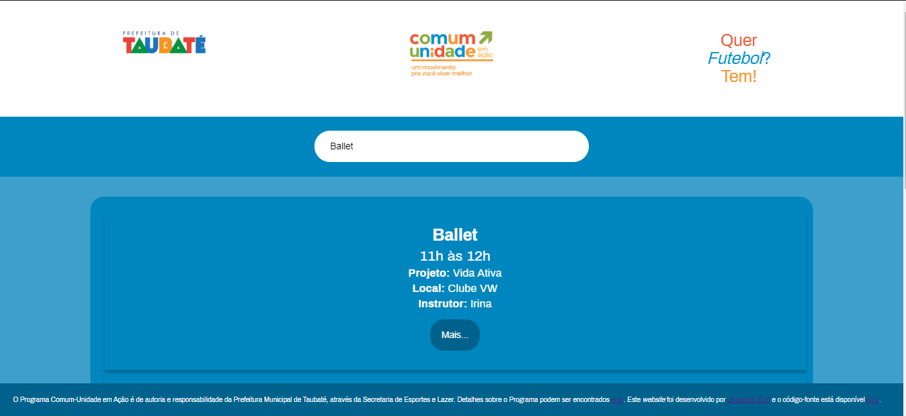
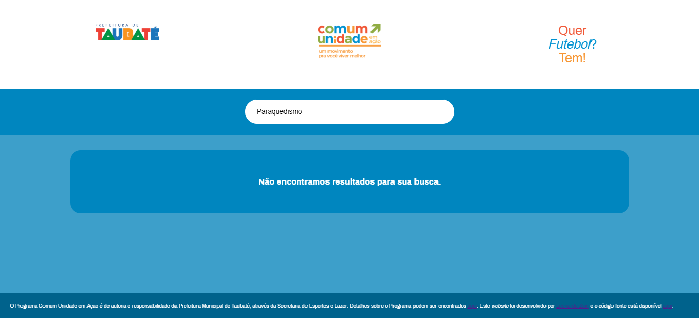
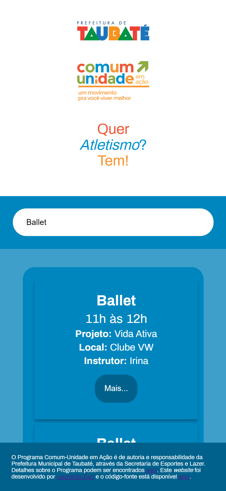

# Website conceitual Programa Comum-Unidade em Ação
Website *single-page* criado com o React.js para a pesquisa das atividades esportivas disponibilizadas pela Secretaria de Esportes e Lazer da 
Prefeitura Municipal de Taubaté.

O objetivo da página é o de aprimorar habilidades com o React.js para a *web* e portfólio, além de uma possível implementação em produção 
na Secretaria de Esportes.

## O que foi utilizado?

**Front End**
* React.js
* React Redux
* HTML5
* CSS 3 (puro)

**Back End**
* Node.js
* MongoDB
* Dependências dev: nodemon
* Dependências: Express (com middleware body-parser e cors), consign e mongoose

## Capturas de tela

### No *desktop*

### No *mobile*

