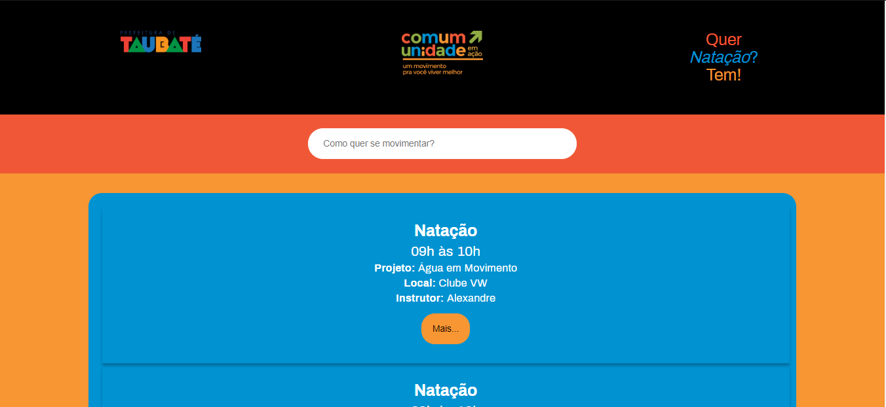
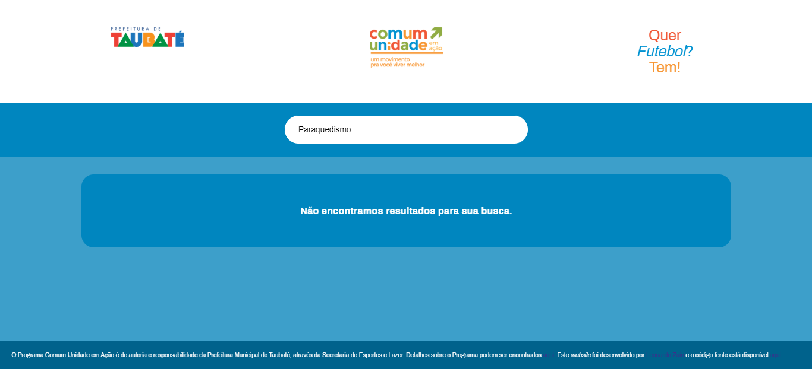
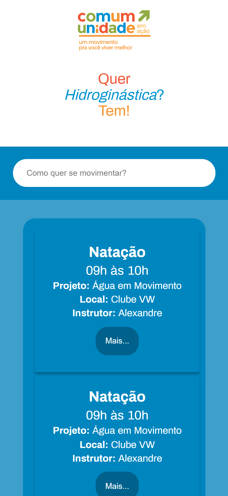
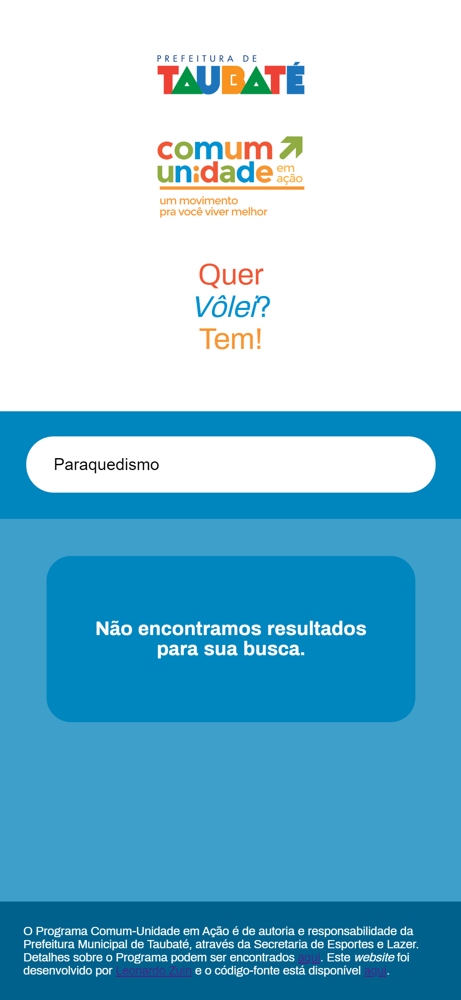

# Website conceitual Programa Comum-Unidade em Ação
Website *single-page* criado com o React.js para a pesquisa das atividades esportivas disponibilizadas pela Secretaria de Esportes e Lazer da 
Prefeitura Municipal de Taubaté.

Foram utilizadas as seguintes bibliotecas e tecnologias:
* React.js
* Redux (React Redux)

O objetivo da página é o de aprimorar habilidades com o React.js para a *web* e portfólio, além de uma possível implementação em produção 
na Secretaria de Esportes.

## Capturas de tela

### No *desktop*

### No *mobile*

